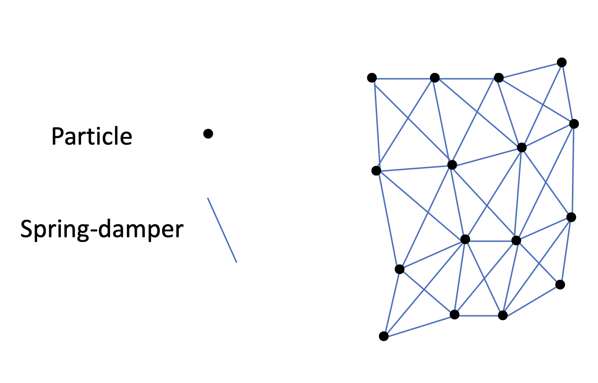
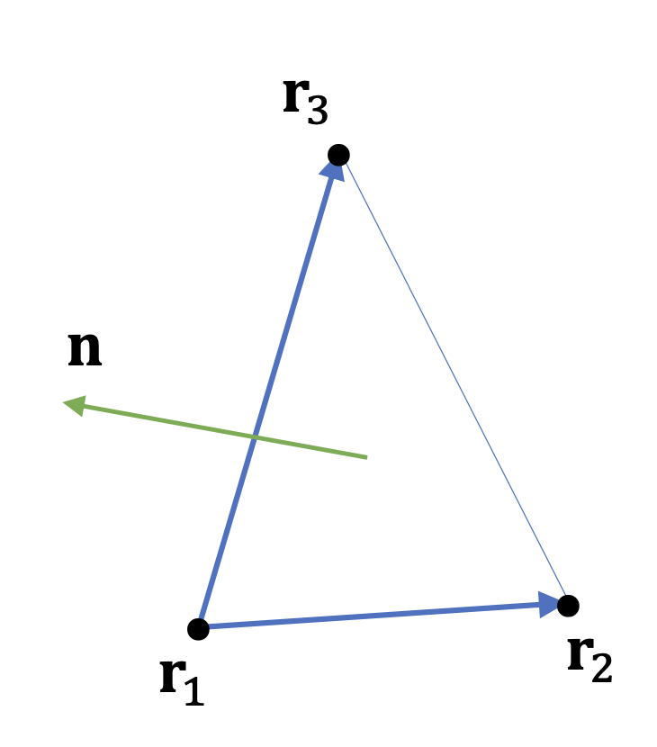
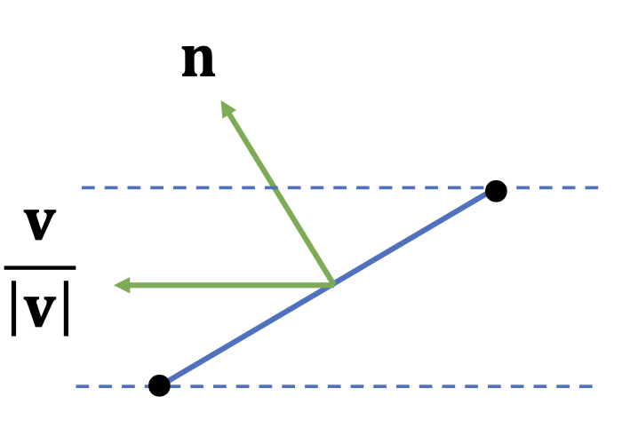

# Background

Particle systems have various uses in graphics since it mimics the elementary particles in the real world. Particles can be used to simulate fire, water, explosions, and other phenomena. When particles are combined with different forces, they can be used to simulate fabric animations.

# Physics

In order to animate particles, we can use Newtonian mechanics to apply forces on the particle.

Using variables we can define a particles position over time as a function $$\mathbf{r}(t)$$ where $$t$$ is the time when a particle is in position $$\mathbf{r}(t)$$.\
Then the velocity $$\mathbf{v}$$ of the particle is the derivative of position:   
&nbsp;&nbsp;&nbsp;&nbsp;$$\mathbf{v}(t) = \frac{\mathrm{d} \mathbf{r}}{\mathrm{d} t}$$.  
And the acceleration $$\mathbf{a}$$ is the derivative of the velocity:   
&nbsp;&nbsp;&nbsp;&nbsp;$$\mathbf{a}(t) = \frac{\mathrm{d} \mathbf{v}}{\mathrm{d} t}$$

In the real world, gravity is constantly acting on every object. The constant acceleration from gravity is about $$9.81 \ m/s^{2}$$. So when a particle undergoes constant acceleration, we can derive the equation for distance:

&nbsp;&nbsp;&nbsp;&nbsp;$$\mathbf{a}(t) = \mathbf{a}_{0}$$.  
&nbsp;&nbsp;&nbsp;&nbsp;$$\mathbf{v}(t) = \int{\mathbf{a}\mathrm{d}t} = \mathbf{v}_{0} + \mathbf{a}_{0}t$$.  
&nbsp;&nbsp;&nbsp;&nbsp;$$\mathbf{r}(t) = \int{\mathbf{v}\mathrm{d}t} = \mathbf{r}_{0} + \mathbf{v}_{0}t + \frac{1}{2}\mathbf{a}_{0}t^{2}$$

$$\mathbf{a}_{0}$$ represents intial acceleration at time $$t = 0$$. Additionaly, $$\mathbf{v}_{0}$$ and $$\mathbf{r}_{0}$$ represent initial velocity and position.

We can assume each particle has a constant mass $$m$$. Momentum $$\mathbf{p}$$ is defined:

&nbsp;&nbsp;&nbsp;&nbsp;$$\mathbf{p} = m\mathbf{v}$$

Force is defined as the rate of change of momentum:

&nbsp;&nbsp;&nbsp;&nbsp;$$\mathbf{f} = \frac{\mathrm{d} \mathbf{p}}{\mathrm{d} t}$$

With constant mass this expands to:

&nbsp;&nbsp;&nbsp;&nbsp;$$\mathbf{f} = \frac{\mathrm{d} \mathbf{p}}{\mathrm{d} t} = \frac{\mathrm{d} (m\mathbf{v})}{\mathrm{d} t} = m\frac{\mathrm{d} \mathbf{v}}{\mathrm{d} t} = m\mathbf{a}$$

### Newton's Laws of Motion

- The first law states that an object in motion will stay in motion or object at rest will stay at rest unless acted upon by a force. From the equation $$\mathbf{r}(t) = \mathbf{r}_{0} + \mathbf{v}_{0}t + \frac{1}{2}\mathbf{a}_{0}t^{2}$$ we see that without a force acting on an object meaning $$\mathbf{a} = 0$$ the distance $$\mathbf{r}$$ will be dependent on the initial values $$\mathbf{r}_{0}$$ and $$\mathbf{v}_{0}$$.
- The second law defines force as:

&nbsp;&nbsp;&nbsp;&nbsp;$$\mathbf{f} = \frac{\mathrm{d} \mathbf{p}}{\mathrm{d} t} = m\mathbf{a}$$

- The third law states any force applied from body A to body B is met with an equal and opposite force:

&nbsp;&nbsp;&nbsp;&nbsp;$$\mathbf{f}_{AB} = -\mathbf{f}_{BA}$$

Since a particle can be subjected to many forces, the total force on a particle is simply the sum of all the forces:

&nbsp;&nbsp;&nbsp;&nbsp;$$\mathbf{f}_{total} = \sum{\mathbf{f}_{i}}$$

# Integration

In order to carry out the simulation, the position of each particle needs to be updated each frame. Integration is necessary since the distance $$\mathbf{r}(t)$$ is the integral of the velocity which is the integral of acceleration. However, not all functions can be analytically integrated. Therefore we must rely on numerical integration to approximate distances.

### Forward Euler Integration

The forwards euler integration uses the derivative to approximate the next value. To calculate the next velocity, we use the current acceleration of the particle mulitplied by the change in time added by the previous velocity:

&nbsp;&nbsp;&nbsp;&nbsp;$$\mathbf{v}_{i+1} = \mathbf{v}_{i} + \mathbf{a}_{i}\Delta{t}$$

To calculate the next distance, we use the new velocity we just calculated mulitplied by the change in time added by the previous distance:

&nbsp;&nbsp;&nbsp;&nbsp;$$\mathbf{r}_{i+1} = \mathbf{r}_{i} + \mathbf{v}_{i+1}\Delta{t}$$

# Basic Forces

### Gravity

&nbsp;&nbsp;&nbsp;&nbsp;$$\mathbf{f}_{gravity} = m\mathbf{g}_0$$

&nbsp;&nbsp;&nbsp;&nbsp;$$\mathbf{g}_0 = [0 \ -9.8 \ 0 ]\frac{m}{s^2}$$

### Aerodynamic Drag Force

&nbsp;&nbsp;&nbsp;&nbsp;$$\mathbf{f}_{drag} = \frac{1}{2}\rho\lvert\mathbf{v}\rvert^2c_da\mathbf{e}$$

- $$\rho$$ is the density of the fluid. The default density of air is $$1.225 kg/m^3$$. 
- $$\mathbf{v}$$ is the relative velocity so $$\mathbf{v} = \mathbf{v}_{particle} - \mathbf{v}_{fluid}$$. 
- $$\mathbf{e}$$ is a unit vector in the opposite direction of velocity: $$\mathbf{e} = -\frac{\mathbf{v}}{\vert\mathbf{v}\rvert}$$. This determines the direction the force acts on.
- $$c_d$$ is the drag coefficient which determines the aerodynamic drag of an object's shape. A value closer to 0 would be considered streamlined while a higher value moves slower through the surrounding fluid.
- $$a$$ is cross sectional area moving through the fluid, which is the area viewed from the direction of motion. A sphere of radius $$r$$ would have an area of $$\pi r^2$$.

### Spring - Damper Force

#### Spring Force

We can use hooke's law to define spring force:

&nbsp;&nbsp;&nbsp;&nbsp;$$\mathbf{f}_{spring} = -k_s\mathbf{x}$$

- $$k_s$$ is the spring constant that determines the stiffness of the spring. 
- $$\mathbf{x}$$ represents the displacement:

&nbsp;&nbsp;&nbsp;&nbsp;&nbsp;&nbsp;&nbsp;&nbsp;$$\mathbf{x} = x\mathbf{e}$$   
&nbsp;&nbsp;&nbsp;&nbsp;&nbsp;&nbsp;&nbsp;&nbsp;$$\mathbf{e} = \frac{r_1 - r_2}{\lvert r_1 - r_2 \rvert}$$   
&nbsp;&nbsp;&nbsp;&nbsp;&nbsp;&nbsp;&nbsp;&nbsp;$$x = \lvert r_1 - r_2 \rvert - l_0$$

$$l_0$$ is the rest length between two particles $$r_1$$ and $$r_2$$ as seen in the image on the right. The force calculated above would act on particle $$r_1$$.

#### Damper Force

&nbsp;&nbsp;&nbsp;&nbsp;$$\mathbf{f}_{damp} = -k_dv_{close}\mathbf{e}$$

- $$k_d$$ is the damping constant that determines how much oscillation decays.
- $$v_{close}$$ is the rate at which two objects are approaching each other:

&nbsp;&nbsp;&nbsp;&nbsp;&nbsp;&nbsp;&nbsp;&nbsp;$$v_{close} = (v_2 - v_1) \cdot \mathbf{e}$$   

- $$\mathbf{e}$$ is calculated the same way as it is with the spring force:

&nbsp;&nbsp;&nbsp;&nbsp;&nbsp;&nbsp;&nbsp;&nbsp;$$\mathbf{e} = \frac{r_1 - r_2}{\lvert r_1 - r_2 \rvert}$$   

The force calculated above would act on on particle $$r_2$$.

### Combining Spring and Damper Force

Since the total force on a particle is the sum of all the forces applied on a particle we can simply add the spring and damper forces together in order to use them both. We need to flip the sign on one of the forces since the forces apply in opposite directions. In order minimize calculations, spring - damper forces should be calculated as below, where $$\mathbf{f}_1$$ is spring-damper force on particle 1 and $$\mathbf{f}_2$$ is spring-damper force on partice 2:

&nbsp;&nbsp;&nbsp;&nbsp;&nbsp;&nbsp;&nbsp;&nbsp;$$\mathbf{e}^* = \mathbf{r}_2 - \mathbf{r}_1$$   
&nbsp;&nbsp;&nbsp;&nbsp;&nbsp;&nbsp;&nbsp;&nbsp;$$l = \lvert \mathbf{e}^* \rvert$$   
&nbsp;&nbsp;&nbsp;&nbsp;&nbsp;&nbsp;&nbsp;&nbsp;$$\mathbf{e} = \frac{\mathbf{e}^*}{l}$$   

&nbsp;&nbsp;&nbsp;&nbsp;&nbsp;&nbsp;&nbsp;&nbsp;$$v_{close} = (\mathbf{v}_1 - \mathbf{v}_2) \cdot \mathbf{e}$$    

&nbsp;&nbsp;&nbsp;&nbsp;&nbsp;&nbsp;&nbsp;&nbsp;$$f = k_s(l-l_0) - k_dv_{close}$$   
&nbsp;&nbsp;&nbsp;&nbsp;&nbsp;&nbsp;&nbsp;&nbsp;$$\mathbf{f}_1 = f\mathbf{e}$$   
&nbsp;&nbsp;&nbsp;&nbsp;&nbsp;&nbsp;&nbsp;&nbsp;$$\mathbf{f}_2 = -\mathbf{f}_1$$   

# Particle Systems

To implement a particle system you can update and calculate positions using the formulas showed above. Spring and damper forces are not necessary for particle systems so you only need to incorporate gravity and aerodynamic forces. Summing the forces together you can calculate the acceleration using $$\mathbf{f} = m\mathbf{a}$$. Then using that accleration you can update the velocity and position of a particle with Euler integration. 

For the particle models you can use any shape, but for simplicity you should use a sphere obj model or a built model from an API like point sprites in OpenGL. Using different models for the particles will require you to adjust the area and direction vector $$\mathbf{e}$$ used in aerodynamic force calculation accordingly. 

You will need to configure your own creation and destruction rules for a particle system. A simple configuration would be to have a maximum amount of particles in a system and for each particle to have a lifespan. Once a particle reaches the end of its lifespan you remove it from the system and create new particles during each update based on a configured rate (for example 3 particles every update call). 

# Cloth Simulation

To simulate cloth animation you can utilize particles with spring-damper forces shown in the figure on the left. The particles and spring-damper forces are mainly used to structure the cloth. You should use triangles for rendering by using the particle positions. You should also use triangles when calculating the aerodynamic force on particles. The velocity of a triangle would be the average velocity of its particles (vertices). Since aerodynamic force uses relative velocity you would then need to subtract the velocity of the air:

&nbsp;&nbsp;&nbsp;&nbsp;&nbsp;&nbsp;&nbsp;&nbsp;$$\mathbf{v} = \frac{\mathbf{v}_1 + \mathbf{v}_2 + \mathbf{v}_3}{3} - \mathbf{v}_{air}$$ 
\
\

For the direction vector $$\mathbf{e}$$ you can use the normal of the triangle, which is calculated using the cross product:

&nbsp;&nbsp;&nbsp;&nbsp;&nbsp;&nbsp;&nbsp;&nbsp;$$\mathbf{n} = \frac{(\mathbf{r}_2 - \mathbf{r}_1) \times (\mathbf{r}_3 - \mathbf{r}_1)}{\lvert(\mathbf{r}_2 - \mathbf{r}_1) \times (\mathbf{r}_3 - \mathbf{r}_1)\rvert}$$
\

To calculate the area you have to take in to consideration the area which is affected by the direction of airflow:

&nbsp;&nbsp;&nbsp;&nbsp;&nbsp;&nbsp;&nbsp;&nbsp;$$a = \frac{1}{2} \lvert (\mathbf{r}_2 - \mathbf{r}_1) \times (\mathbf{r}_3 - \mathbf{r}_1) \rvert (\frac{\mathbf{v}}{\lvert  \mathbf{v} \rvert} \cdot \mathbf{n})

# Video Demos

Particle System Demo:

Cloth Simulation Demo:

# Resources

Slides are from Steve Rotenberg UCSD Winter 2021 Computer Animation (CSE 169)

- [Particle Simulation Slides](slides/Particle Systems.pdf)
- [Cloth Simulation Slides](slides/Cloth Simulation.pdf)
- [Collision Detection Slides](slides/Collision Detection.pdf)


